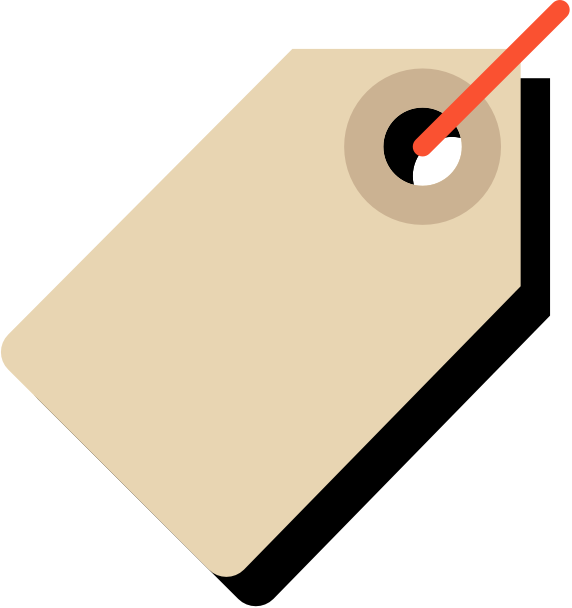

<div style="text-align: center; margin-top: 100px">
    
</div>

# a Lodjinha

## Tecnologia usada

- React-Native

## Uso

- Primeiro você precisar escolher onde vai executar o projeto, em um emulador ou no seu celular.
- - **No seu celular** conecte o seu celular ao computar por meio de um cabo usb, e permita o acesso.
- - **No Emulador** Execute o emulator por meio do Android Studio ou por meio do [GenyMotion](https://www.genymotion.com/)
- - E siga os seguintes passos:

- Você vai precisar ter o [nodejs](https://nodejs.org/en/) instalado na sua maquina e o [kit](https://facebook.github.io/react-native/docs/getting-started#3-configure-the-android_home-environment-variable) previamente configurado.

- Tendo tudo configurado, entre na pasta do projeto ``` cd aLodjinha ```, e execute ``` npm i ``` para instalar as dependencias e ``` npx react-native run-android ``` parar executar a aplicação. 

- Lembrando que dessa forma, ficara mais facil verificar o codigo, e aplicação mais de perto.
